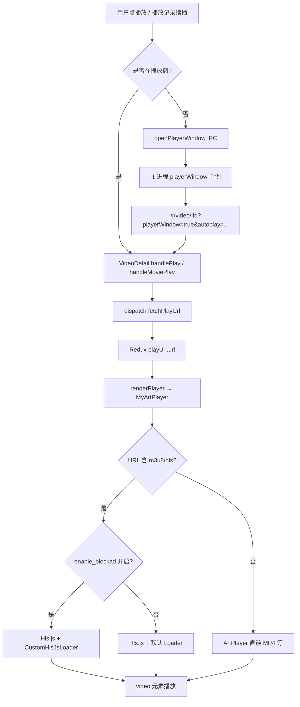

# 视频播放跳过逻辑说明（去广告 & 片头片尾）

> **说明**：`mac-arm64` 与 `mac-x64` 共用同一套 **渲染进程（React）** 代码，主进程为 Electron `BrowserWindow`。**去广告与片头/片尾跳过逻辑全部在 `MyArtPlayer.js`**，与 CPU 架构无关。

---

## 概述：两套「跳过」机制

| 机制 | 类型 | 存储键 | 默认 | 适用流 |
|------|------|--------|------|--------|
| **去广告** | M3U8 清单过滤 | `enable_blockad` | 开启 | 仅 HLS（m3u8） |
| **片头/片尾跳过** | 按时间 `seek` | `wtv_skip_configs` | 关闭 | 任意格式 |

二者相互独立：去广告在 **网络层** 改写 m3u8；片头/片尾在 **播放层** 监听 `timeupdate`。

---

## 一、播放主链路



| 环节 | 位置 | 要点 |
|------|------|------|
| 打开播放窗 | `src/main/main.js` → `open-player-window` | 单例 `playerWindow`，URL 带 `playerWindow=true`、`autoplay=true` |
| 判定播放窗 | `VideoDetail.js` | `isPlayerWindow = searchParams.get('playerWindow') === 'true'` |
| 拉播放地址 | `videoSlice` → `fetchPlayUrl` → `/video/play` | 得到 `play_url`（多为 m3u8） |
| 实际播放 | `MyArtPlayer` | ArtPlayer + Hls.js，`customType.m3u8` 分支 |

`VideoDetail.js` 里曾有的 **手动创建第二套 Hls 实例** 已 **`if (false && ...)` 禁用**，全平台 **只走 `MyArtPlayer` 一套 HLS**。

---

## 二、去广告：设计目标与原理

### 2.1 做什么、不做什么

| 项目 | 说明 |
|------|------|
| **做法** | 在拉取 **M3U8 清单文本** 时，删掉含 `#EXT-X-DISCONTINUITY` 的行 |
| **依据** | 许多 HLS 源用 **DISCONTINUITY** 标出正片与广告段边界（对齐 LunaTV） |
| **效果** | Hls.js 把相邻 TS 片段当作 **连续时间线**，播放时 **不进入广告分段** |
| **不做** | 不解析广告 URL、不拦截单独广告域名、不裁剪 TS 二进制 |

### 2.2 核心函数：`filterAdsFromM3U8`

**文件**：`src/renderer/src/components/MyArtPlayer.js`

```javascript
function filterAdsFromM3U8(m3u8Content) {
  if (!m3u8Content) return '';
  return m3u8Content
    .split('\n')
    .filter(line => !line.includes('#EXT-X-DISCONTINUITY'))
    .join('\n');
}
```

- 按行拆分 → 丢弃含 `#EXT-X-DISCONTINUITY` 的行 → 拼回字符串。
- 只删 **标记行**，不删 `#EXTINF` / 分片 URL 行本身。
- 若源站广告 **不用 DISCONTINUITY** 分段，此方案 **无效**。

#### 过滤前后示例

**过滤前（含广告分界）：**

```text
#EXTINF:6.000,
segment1.ts
#EXT-X-DISCONTINUITY
#EXTINF:15.000,
ad_segment.ts
#EXT-X-DISCONTINUITY
#EXTINF:6.000,
segment2.ts
```

**过滤后（DISCONTINUITY 行被移除）：**

```text
#EXTINF:6.000,
segment1.ts
#EXTINF:15.000,
ad_segment.ts
#EXTINF:6.000,
segment2.ts
```

Hls.js 将相邻片段视为同一连续流；广告 TS 仍在清单中，但因无分界标记，播放器会按连续时间线处理（具体效果取决于源站分段方式）。

---

## 三、注入时机：`CustomHlsJsLoader`

### 3.1 类职责

继承 `Hls.DefaultConfig.loader`，在 **`manifest`**、**`level`** 两类请求成功时改写响应体：

```text
网络返回 m3u8 文本
    → onSuccess 回调前
    → 若 response.data 为 string
    → response.data = filterAdsFromM3U8(response.data)
    → 再交给 Hls.js 解析
```

```javascript
class CustomHlsJsLoader extends Hls.DefaultConfig.loader {
  constructor(config) {
    super(config);
    const load = this.load.bind(this);
    this.load = function (context, hlsConfig, callbacks) {
      if (context.type === 'manifest' || context.type === 'level') {
        const onSuccess = callbacks.onSuccess;
        callbacks.onSuccess = function (response, stats, ctx, networkDetails) {
          if (response.data && typeof response.data === 'string') {
            response.data = filterAdsFromM3U8(response.data);
          }
          return onSuccess(response, stats, ctx, networkDetails);
        };
      }
      load(context, hlsConfig, callbacks);
    };
  }
}
```

| `context.type` | 是否过滤 | 含义 |
|----------------|----------|------|
| `manifest` | ✅ | 主播放列表 |
| `level` | ✅ | 清晰度/子清单 |
| 其他（如 `frag` 分片） | ❌ | TS 分片不经此过滤 |

### 3.2 与 Hls 实例绑定

HLS 判定：`url.toLowerCase()` 含 `.m3u8` 或 `hls`。

创建 Hls 时：

```javascript
const hls = new HlsClass({
  loader: blockAdEnabledRef.current
    ? CustomHlsJsLoader          // 开启：过滤 #EXT-X-DISCONTINUITY
    : HlsClass.DefaultConfig.loader, // 关闭：原样 m3u8
  enableWorker: true,
  // ... 其他缓冲/超时配置
});
hls.loadSource(src);
hls.attachMedia(video);
```

- **开启去广告**：用 `CustomHlsJsLoader`
- **关闭去广告**：官方默认 Loader，原样 m3u8

---

## 四、去广告开关与持久化

### 4.1 默认状态

```javascript
function readBlockAdSetting() {
  try {
    const v = localStorage.getItem('enable_blockad');
    return v !== null ? v === 'true' : true;
  } catch (_) {
    return true;
  }
}
```

| 项 | 值 |
|----|-----|
| localStorage 键 | `enable_blockad` |
| 未设置时 | **默认 `true`（开启）** |
| 读取函数 | `readBlockAdSetting()` |
| React state | `blockAdEnabled` / `blockAdEnabledRef` |

### 4.2 用户切换（播放器设置 →「去广告」）

ArtPlayer **设置面板** 中的开关逻辑：

```javascript
art.setting.add({
  name: '去广告',
  html: '去广告',
  tooltip: blockAdEnabledRef.current ? '已开启' : '已关闭',
  switch: blockAdEnabledRef.current,
  onSwitch: function (item) {
    const newVal = !item.switch;
    pendingResumeRef.current = art.currentTime || 0;
    localStorage.setItem('enable_blockad', String(newVal));
    blockAdEnabledRef.current = newVal;
    setBlockAdEnabled(newVal); // 触发播放器重建
    return newVal;
  },
});
```

切换步骤：

1. 把当前 `art.currentTime` 写入 `pendingResumeRef`（重建后续播）
2. `localStorage.setItem('enable_blockad', String(newVal))`
3. `setBlockAdEnabled(newVal)` → 触发 `useEffect([url, blockAdEnabled])`
4. **销毁** 旧 ArtPlayer / Hls → **重建**（新 Loader 才生效）
5. `canplay` 时用 `pendingResumeRef` **恢复进度**

```javascript
if (pendingResumeRef.current !== null) {
  const t = pendingResumeRef.current;
  pendingResumeRef.current = null;
  art.video.addEventListener('canplay', function seekOnce() {
    if (t > 0) art.seek = t;
    art.video.removeEventListener('canplay', seekOnce);
  }, { once: true });
}
```

### 4.3 触发重建播放器的条件

`useEffect` 依赖：**`url`** 或 **`blockAdEnabled`** 变化 → 整实例销毁并重建（与 LunaTV 一致）。

---

## 五、去广告端到端时序

```text
1. fetchPlayUrl → playUrl.url（m3u8 地址）
2. MyArtPlayer mount，readBlockAdSetting() → blockAdEnabled=true
3. ArtPlayer customType.m3u8：
     new Hls({ loader: CustomHlsJsLoader, ... })
     hls.loadSource(src) / attachMedia(video)
4. Hls 请求 manifest/level
     → CustomHlsJsLoader 过滤 DISCONTINUITY 行
     → Hls 按「无广告分界」的清单缓冲、播放
5. 用户关闭「去广告」
     → 保存进度 → 重建 Hls（DefaultConfig.loader）→ 恢复进度
```

---

## 六、片头/片尾跳过（与去广告无关）

### 6.1 配置结构

**文件**：`src/renderer/src/components/MyArtPlayer.js`

| 项 | 说明 |
|----|------|
| localStorage 键 | `wtv_skip_configs` |
| 索引 | `videoId`（字符串） |
| 配置结构 | `{ enable, intro_time, outro_time }` |
| 默认值 | `{ enable: false, intro_time: 0, outro_time: 0 }` |

字段含义：

| 字段 | 类型 | 说明 |
|------|------|------|
| `enable` | `boolean` | 是否启用片头/片尾跳过 |
| `intro_time` | `number` | 片头时长（秒，正数）；播放时间小于此值时跳过 |
| `outro_time` | `number` | 片尾偏移（秒，**负数**表示距视频末尾）；超过触发点时跳过 |

```javascript
function readSkipConfig(videoId) {
  const defaultCfg = { enable: false, intro_time: 0, outro_time: 0 };
  if (!videoId) return defaultCfg;
  try {
    const all = JSON.parse(localStorage.getItem('wtv_skip_configs') || '{}');
    return all[String(videoId)] || defaultCfg;
  } catch (_) {
    return defaultCfg;
  }
}
```

> **注意**：当前代码库仅有 **读取** `wtv_skip_configs` 的逻辑，**暂无 UI 写入**该配置；需通过 localStorage 手动或外部工具写入后才会生效。

### 6.2 检测逻辑（`timeupdate`）

在 `handleTimeUpdate` 中执行，**1.5 秒节流**（与 LunaTV 一致）：

```javascript
const cfg = skipConfigRef.current;
if (cfg.enable) {
  const now = Date.now();
  if (now - lastSkipCheckRef.current >= 1500) {
    lastSkipCheckRef.current = now;

    // 跳过片头
    if (cfg.intro_time > 0 && currentTime < cfg.intro_time) {
      art.seek = cfg.intro_time;
      art.notice.show = `已跳过片头 (${formatSkipTime(cfg.intro_time)})`;
    }

    // 跳过片尾
    if (
      cfg.outro_time < 0 &&
      dur > 0 &&
      currentTime > dur + cfg.outro_time
    ) {
      art.notice.show = `已跳过片尾`;
      if (onNextEpisodeRef.current) {
        onNextEpisodeRef.current();
      } else if (onEndedRef.current) {
        onEndedRef.current();
      }
    }
  }
}
```

| 场景 | 条件 | 行为 |
|------|------|------|
| 跳过片头 | `enable` 且 `intro_time > 0` 且 `currentTime < intro_time` | `seek` 到 `intro_time`，显示提示 |
| 跳过片尾 | `enable` 且 `outro_time < 0` 且 `currentTime > duration + outro_time` | 调用 `onNextEpisode` 或 `onEnded` |

`VideoDetail.js` 传入 `onNextEpisode={handleEnded}`，片尾跳过会走与播放结束相同的连播/保存逻辑。

### 6.3 `videoId` 变化

```javascript
useEffect(() => {
  videoIdRef.current = videoId;
  skipConfigRef.current = readSkipConfig(videoId);
}, [videoId]);
```

切换视频时自动重新加载对应跳过配置。

---

## 七、与去广告的对比

| 对比项 | 去广告 | 片头/片尾跳过 |
|--------|--------|---------------|
| 实现层 | HLS Loader（网络响应改写） | `timeupdate` 事件（播放时间检测） |
| 作用对象 | m3u8 清单中的 DISCONTINUITY 标记 | 用户配置的秒数 |
| 用户入口 | 播放器设置「去广告」开关 | 无 UI（仅 localStorage 配置） |
| 切换后行为 | 销毁并重建播放器 | 无需重建，实时生效 |
| 适用范围 | 仅 HLS | MP4 / HLS 均可 |

---

## 八、相关文件索引

| 文件 | 作用 |
|------|------|
| `src/renderer/src/components/MyArtPlayer.js` | **去广告 + 片头片尾跳过全部实现** |
| `src/renderer/src/pages/VideoDetail.js` | 拉流、`MyArtPlayer` 挂载（`videoId`、`onNextEpisode`）；旧 HLS 注入已禁用 |
| `src/main/main.js` | `open-player-window`，播放窗入口 |
| `src/main/preload.js` | `openPlayerWindow` IPC 暴露 |

---

## 九、局限与排查建议

### 去广告

1. **仅对 HLS（m3u8）有效**；MP4 等直链无此逻辑。
2. **依赖源站用 `#EXT-X-DISCONTINUITY` 标广告**；否则开关无感。
3. 去广告后若 **时间轴/音画异常**，可在设置里 **关闭去广告** 对比（会重建播放器）。

### 片头/片尾

1. 需 `wtv_skip_configs` 中对应 `videoId` 的 `enable: true` 才生效。
2. `outro_time` 必须为负数（如 `-90` 表示距末尾 90 秒触发）。
3. 节流 1.5s，极短片头/片尾区间可能检测延迟。

### 通用

- Mac ARM 与 x64 **行为一致**；若仅某一架构异常，优先查 **网络/CDN/签名 URL 过期**，而非架构分支代码。
